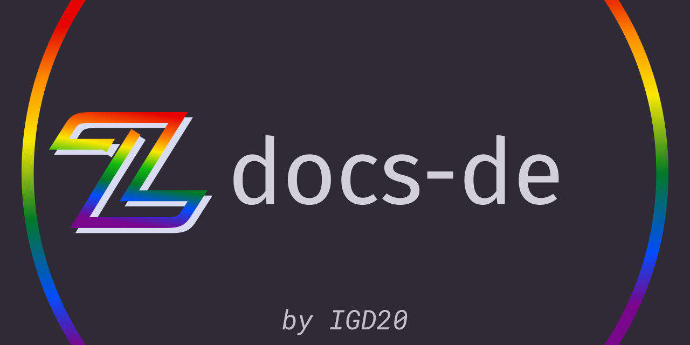

# zwoo-hq/docs-de

The official zwoo documentation.

This is the german translation.

This docs site consists of 3 individual vitepress sites for:

- docs: the genral documentation of the game (with rule references, faq, etc.)
- api: the zwoo HTTP and WS API
- dev: docs targeted at zwoo developers

Every site uses the [@zwoo/docs-theme](https://github.com/zwoo-hq/theme-docs) custom vitepress theme.

## Languages

| Language | Repo                                            |
| -------- | ----------------------------------------------- |
| en       | [zwoo-hq/docs](https://github.com/zwoo-hq/docs) |
| __de__   | this one                                        |

## Development

Install dependencies

`pnpm i`

and run the setup script to copy initial common files

`pnpm run setup`

And run a site:

`pnpm run docs:dev` or `api:dev` or `dev:dev`

To serve a preview use: `pnpm run (docs|dev|api):serve`

To build a site: `pnpm run (docs|dev|api):build`

To build all: `pnpm run build`

### Automated build scripts

There are a few build scripts use to automate the build process. They:

- copy the OpenAPI spec into the out dir
- create a 'link' to vitepress's localSearchIndex in order to make it accessible from outside to be used in the zwoo frontend.

## Language sync

Englisch ist the master language. The documentation will be primarily written in english. All subsequent languages sync the changes via the `.github/workflows/sync.yml` workflow individually.