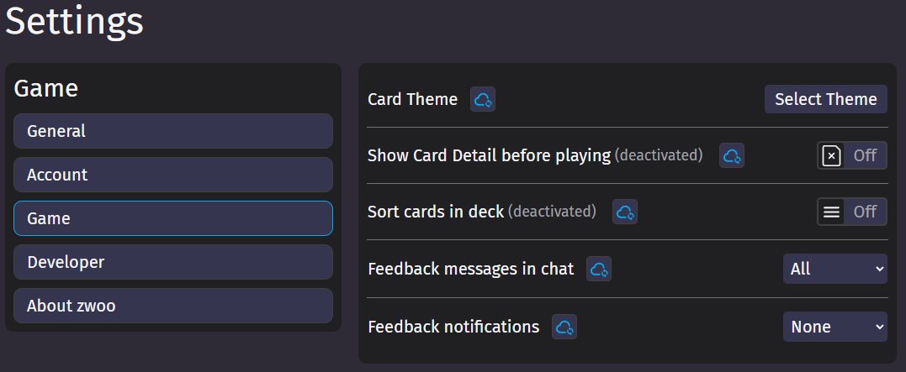
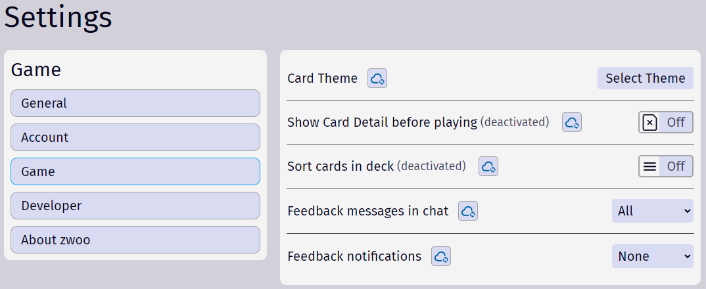

# Settings

Inside the [game settings](https://zwoo.igd20.de/settings/game) there are multiple options that can be configured to customize your game experience

{.dark-only}
{.light-only}

### Card theme

By clicking on the "Select theme" button, the [theme gallery](https://zwoo.igd20.de/themes/gallery) opens. Here you can choose between different card themes. The selected theme will be applied to all games you play.

### Show card detail before playing

When this option is enabled, you will see an overlay displaying the card you wanted to play before it is actually played. Inside this preview, you can still change the card you want to play. This is especially useful when you have many cards in your deck or on a small device. It's also possibly to toggle this option from the in game menu.

::: info Info
This option is enabled by default on mobile devices.

It will also be enabled if the amount of cards in your deck surpasses a certain threshold.
:::

### Sort cards in deck

When enabled, the cards in your deck will be sorted by color and then by type. This can make it easier to find the card you are looking for. It's also possibly to toggle this option from the in game menu.

### Feedback messages in chat

Available options: `All`, `Only mine` or `None`.

When this option is set to `All` or `Only mine`, you will receive feedback messages in the chat. Feedback messages are events that happened in the game, like the direction was reversed, a player was skipped or had to draw cards. When set to `All`, you will see all feedback messages. When set to `Only mine`, you will only see feedback messages that are related to you. Settings this option to `None` will hide all feedback messages in the chat.

### Feedback notifications

Available options: `All`, `Only mine` or `None`.

Feedback notification work exactly like [feedback messages in chat](#feedback-messages-in-chat), but instead of showing them in the chat, you will receive a notification at the top of the screen.
